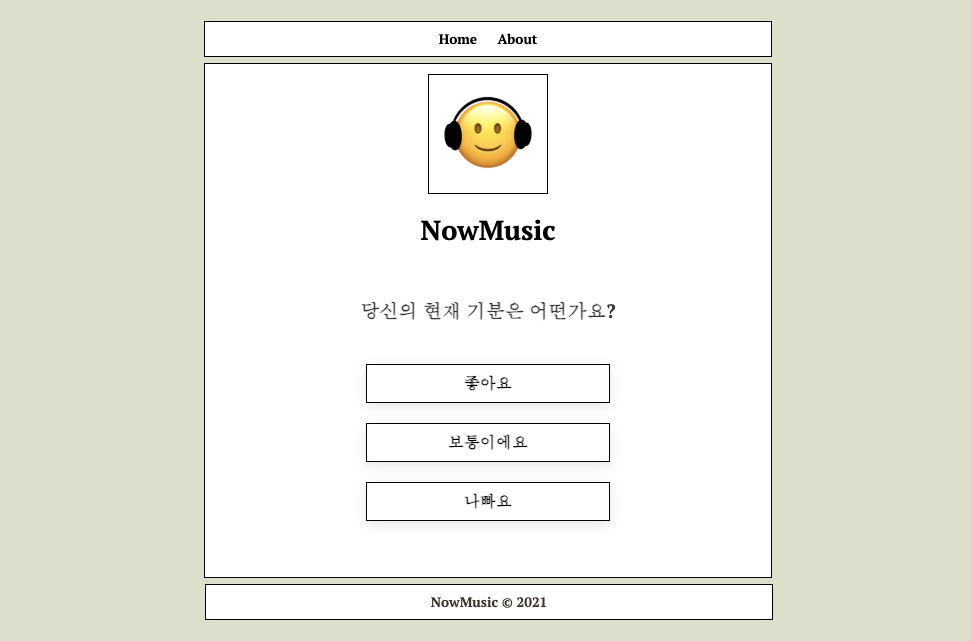
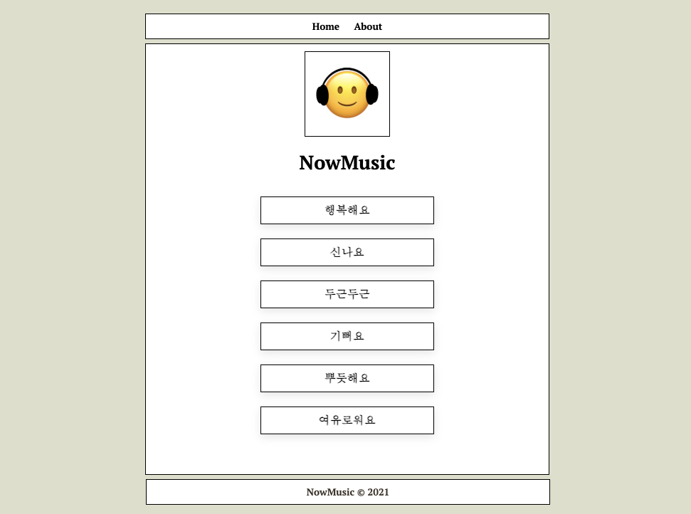

# nowmusic.github.io

```shell

NowMusic은 당신의 상황과 기분을 골라 유튜브 플레이리스트를 추천하는 서비스 입니다.

```

## 🎶 당신의 상황과 기분을 골라 추천 플레이리스트를 즐겨보세요.

<div style="text-align: center;"></div>

## 🙂 NowMusic 사용법

### 1. 당신의 기분을 선택하세요.

<div style="text-align: center;"></div>

### 2. 당신의 기분에 따른 감정을 선택하세요.

<div style="text-align: center;"></div>

### 3. 결과에 따라 플레이리스트를 추천받을 수 있습니다.

<div style="text-align: center;"></div>

<br>

## 만든 사람들

<table>
<tr>
<th>Profile</th>
<th>Name</th>
<th>Role</th>
</tr>
<tr>

<td><div style="text-align: center;"></div></td>

<td><a href="https://github.com/Yoonseo1014">Yoonseo1014</a></td>

<td>디자인,프론트엔드</td>

</tr>

<tr>

<td><div style="text-align: center;"></div></td>

<td><a href="https://github.com/bny1207">bny1207</a></td>

<td>프론트엔드,데이터 수집 및 정리</td>

</tr>

<tr>

<td><div style="text-align: center;"></div></td>

<td><a href="https://github.com/dhrgodms">dhrgodms</a></td>

<td>프론트엔드,리팩토링</td>

</tr>

</table>
